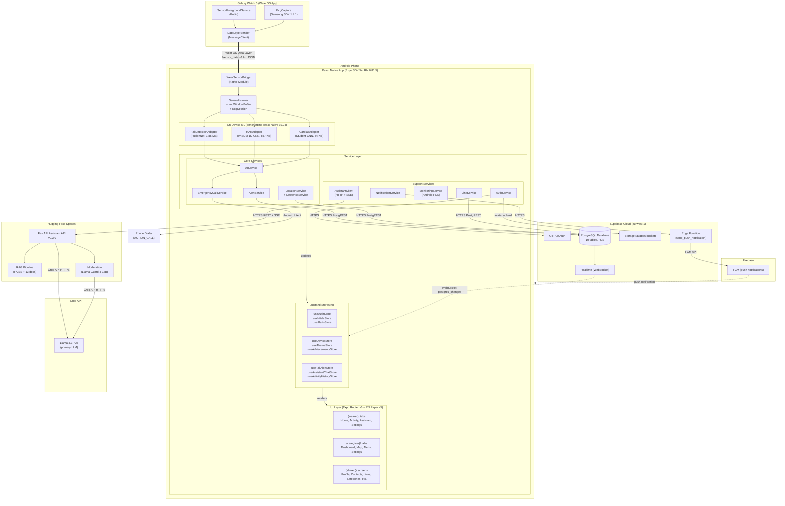

# Smart Health Monitoring System

A comprehensive, state-of-the-art graduation project platform that integrates wearable-based health tracking, real-time safety alerting, on-device machine learning, and an intelligent cloud-hosted clinical assistant.

This repository contains the complete codebase, configuration files, and documentation for the entire graduation project system.

---

## Project Deliverables

The complete project deliverables — **promo video · presentation deck · poster · documentation (thesis + diagrams)** — are hosted here:

> **Project Deliverables (promo · presentation · poster · documentation):** https://drive.google.com/drive/folders/1ebZg4mYIdYCZZxk1aHzHNigqmKham04D

---

## System Architecture

The Smart Health Monitoring System is built as a distributed, multi-agent platform connecting wearable sensors directly to on-device edge AI, cloud storage, and large language model reasoning APIs.



---

## Repository Structure

```
D:/GP-IMP/
├── Assistant/            # FastAPI LLM clinical assistant API (FastAPI + Groq + FAISS RAG)
├── Cardiac/              # ECG beat classification models & pipelines (PyTorch + ONNX)
├── fall_detection_edge/  # FusionNet Wrist Fall Detection (PyTorch + ONNX)
├── HAR/                  # Human Activity Recognition on wrist IMU (WISDM 1D-CNN)
├── smart-health-54/      # React Native / Expo cross-platform mobile client
└── wear_app/             # Wear OS watch companion client (Kotlin + Samsung Health SDK)
```

> The **Documentation** (thesis · diagrams · ERD), **promo**, **presentation**, and **poster** are shared via the **Project Deliverables** link at the top of this README.

---

## Component Overviews & Quick Start

Click on the links below to read the comprehensive README files with detailed setup, build, and training instructions for each subproject:

### 1. [Mobile Client (smart-health-54)](file:///D:/GP-IMP/smart-health-54/README.md)
* **Description**: React Native app (Expo SDK 54) targeting Wearer and Caregiver roles. Hosts on-device ONNX classifiers for real-time edge processing.
* **Tech Stack**: React Native, Expo, Expo Router, Zustand (9 state stores), TailwindCSS/Vanilla styles, ONNX Runtime React Native (`onnxruntime-react-native`).
* **On-Device Models**:
  * **Fall Detection**: 1.86 MB FusionNet ONNX model.
  * **Cardiac Beat Classifier**: 64 KB Student CNN ONNX model.
  * **HAR**: 667 KB WISDM 1D-CNN ONNX model (tuned for Galaxy Watch 5).

### 2. [Wear OS Companion (wear_app)](file:///D:/GP-IMP/wear_app/README.md)
* **Description**: Wearable companion application streaming accelerometer, gyroscope, and PPG heart rate data.
* **Tech Stack**: Kotlin, Samsung Health Sensor SDK, Wear OS Data Client API (low-latency streaming).

### 3. [Clinical LLM Assistant (Assistant)](file:///D:/GP-IMP/Assistant/README.md)
* **Description**: High-performance backend clinical RAG assistant providing medically grounded replies, drug-drug interaction warning checks, and vital sign thresholding.
* **Tech Stack**: FastAPI, Python 3.12, FAISS, Llama 3.3 70B (via Groq), Llama-Guard (input/output moderation), Docker.
* **Production Deployment**: Deployed on Hugging Face Spaces.

### 4. [Fall Detection Edge (fall_detection_edge)](file:///D:/GP-IMP/fall_detection_edge/README.md)
* **Description**: Training and evaluation code for the **FusionNet Wrist** model—a dual-stream 1D-CNN using accelerometer, gyroscope, and barometric sensor data to detect falls honestly.
* **Tech Stack**: PyTorch, Scikit-learn, ONNX.
* **Performance**: 9-Fold honest Leave-One-Subject-Out (LOSO) evaluation yielding **0.971 AUC** and **86.1% F1 Score**.

### 5. [Cardiac Beat Classifier (Cardiac)](file:///D:/GP-IMP/Cardiac/README.md)
* **Description**: ECG beat-by-beat classifier based on the AAMI classification standards (Normal, S-ectopic, V-ectopic, Fusion).
* **Tech Stack**: PyTorch, Scikit-learn, ONNX.
* **Performance**: ~15.8k parameter Student CNN (64 KB ONNX). Reaches **0.9627 Normal Beat Recall** and **0.999 Normal Beat Dominance** on the independent hold-out CinC 2017 dataset.

### 6. [Human Activity Recognition (HAR)](file:///D:/GP-IMP/HAR/README.md)
* **Description**: Wrist-based activity classifier recognizing user locomotion states (Walking, Jogging, Stationary) to filter out false alerts.
* **Tech Stack**: PyTorch, ONNX.
* **Performance**: 667 KB 1D-CNN trained on the WISDM dataset achieving **94.4% window accuracy**.

### 7. Documentation
* The official thesis document (`Smart Health Monitoring System - Documentation.docx` & `.pdf`), plus database architecture schemas, Entity-Relationship Diagrams (ERD), and UML Use Case / Class diagrams.
* Hosted via the **Project Deliverables** link at the top of this README.

---

## Database Schema & Infrastructure

The platform leverages **Supabase Cloud (PostgreSQL)** as its real-time storage engine. Row-Level Security (RLS) policies are active across all tables, ensuring strict wearer privacy and authorizing linked caregivers to view biometrics.

The database schema is comprised of **10 tables**:
1. **`profiles`**: Extends PostgreSQL Auth users. Stores wearer and caregiver profile data, medical metadata (conditions, current medications, age, sex), and target FCM push tokens (`fcm_token`).
2. **`devices`**: Smartwatch hardware inventory tracking battery levels, online status, and last-seen timestamps.
3. **`caregiver_links`**: The bridge table resolving many-to-many relationships linking caregivers to wearers via invitation codes.
4. **`alerts`**: Logs of health/safety events (types: `fall`, `sos`, `geofence`, `low_battery`, `cardiac`, `inactivity`). Supports resolution workflows.
5. **`vitals`**: High-frequency time-series biometrics (heart rate, Spo2, skin temperature, and active HAR activity label).
6. **`locations`**: GPS coordinates tracking wearer location history.
7. **`geofences`**: Safe zones (circular boundaries with coordinates and radii) defined by caregivers for a wearer.
8. **`location_requests`**: Triggers silent caregiver-initiated real-time location queries over the WebSocket data channel.
9. **`assistant_feedback`**: Logs of clinical chat interactions (including RAG sources, LLM latency, and user ratings).
10. **`achievements`**: Gamification achievements unlocked by the wearer.

---

## Global Setup

To set up the entire workspace locally:

1. **Prerequisites**:
   * **Node.js** v18+ & **npm** / **yarn**
   * **Python 3.12**
   * **Android Studio & SDK** (for React Native and Wear OS development)
   * **Supabase CLI** (optional, for local migration runs)

2. **Clone and Install**:
   * Navigate into `smart-health-54/` and run `npm install` to set up the React Native app.
   * Navigate to `Assistant/`, `Cardiac/`, and `fall_detection_edge/` to build their respective python environments (`python -m venv venv` followed by pip installations).

*For detailed setup steps of each individual component, check their respective folder READMEs.*

---

## License

Copyright (C) 2026 Youssef Gamal.

This project is licensed under the **GNU General Public License v3.0** — see [LICENSE](LICENSE) for the full text.

The license covers this repository's own source code. The bundled ONNX model weights are trained on third-party research datasets (MIT-BIH Arrhythmia, PhysioNet/CinC 2017, WISDM, FallAllD), which retain their own licenses and usage terms.
